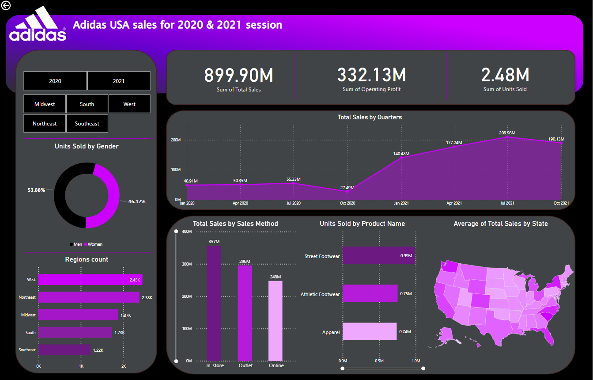

# Adidas USA Sales Dashboard Project

This project presents a comprehensive sales analysis for Adidas in the USA, covering sales data for the years 2020 and 2021. The analysis includes data visualization on total sales, units sold, operating profit, and sales methods. The primary tools used in this project are Excel and Power BI for data visualization.

## Dataset Overview
The dataset contains sales data for Adidas USA from different regions, including details like:

- **Retailer:** Name of the retailer (e.g., Foot Locker)
- **Retailer ID:** A unique identifier for each retailer
- **Invoice Date:** Date of the sales transaction
- **Region:** The geographical area of the sale (e.g., Northeast, Midwest)
- **State & City:** Location of the sales within the USA
- **Buyer Type:** The demographic of the buyer (Men or Women)
- **Product Name:** Type of product sold (Apparel, Street Footwear, Athletic Footwear)
- **Units Sold:** Number of units sold
- **Total Sales:** Dollar value of the total sales
- **Operating Profit:** Profit made from the transaction
- **Operating Margin:** Percentage of profit made from the sales
- **Sales Method:** The channel through which the sales were made (e.g., Online, Outlet, In-store)

## Dashboard Summary

The dashboard provides insights on various key performance indicators (KPIs) for Adidas USA’s sales. The visualizations included are:

- **Total Sales (899.90M USD)**
- **Operating Profit (332.13M USD)**
- **Total Units Sold (2.48M)**

### Dashboard Visuals

1. **Units Sold by Gender:**  
   - **Men:** 46.12%  
   - **Women:** 53.88%

2. **Total Sales by Quarters (2020-2021):**  
   Quarterly breakdown of total sales, showcasing growth and trends over time.

3. **Units Sold by Product Name:**  
   Breakdown of product categories, such as:
   - **Street Footwear:** 0.99M units
   - **Athletic Footwear:** 0.75M units
   - **Apparel:** 0.74M units

4. **Sales by Regions:**  
   - **West:** 2.45K  
   - **Northeast:** 2.38K  
   - **Midwest:** 1.87K  
   - **South:** 1.73K  
   - **Southeast:** 1.22K

5. **Sales by Method:**  
   Total sales categorized by sales methods:
   - **In-store:** 357M USD  
   - **Outlet:** 296M USD  
   - **Online:** 248M USD

6. **Total Sales by State:**  
   Visual representation of average sales by state across the USA.

### Key Insights:
- Sales growth was particularly strong in 2021, with **140.48M USD** in total sales in January alone.
- **Street Footwear** is the leading product category, with almost **1M units sold**.
- **In-store** purchases dominate the sales method, contributing **357M USD** to the total revenue.

## Conclusion

This analysis highlights the key trends in Adidas USA sales for 2020 and 2021. The dashboard provides actionable insights into buyer demographics, sales channels, and regional performance, allowing for data-driven decision-making.

## Tools Used
- **Microsoft Excel:** For data cleaning and pre-processing.
- **Power BI:** For creating the visualizations and interactive dashboard.
