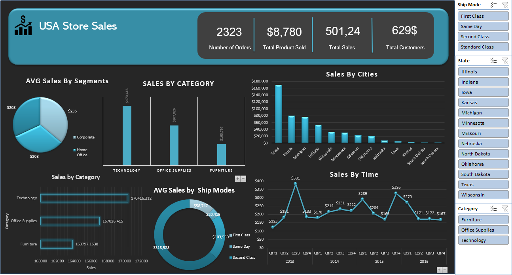

# Adidas USA Sales Dashboard Project

## Dataset Overview

The dashboard provides insights on various key performance indicators (KPIs) for Adidas USA’s sales. These KPIs include:

- **Retailer:** Name of the retailer (e.g., Foot Locker)
- **Retailer ID:** A unique identifier for each retailer
- **Invoice Date:** Date of the sales transaction
- **Region:** The geographical area of the sale (e.g., Northeast, Midwest)
- **State & City:** Location of the sales within the USA
- **Buyer Type:** The demographic of the buyer (Men or Women)
- **Product Name:** Type of product sold (Apparel, Street Footwear, Athletic Footwear)
- **Units Sold:** Number of units sold
- **Total Sales:** Dollar value of the total sales
- **Operating Profit:** Profit made from the transaction
- **Operating Margin:** Percentage of profit made from the sales
- **Sales Method:** The channel through which the sales were made (e.g., Online, Outlet, In-store)

## Dashboard

**Data Cleaning:**
- Removed duplicate records
- Corrected inconsistent data entries
- Handled missing values

Here is a sample of the dataset:

### Units Sold by Gender:  
   - **Men:** 46.12%  
   - **Women:** 53.88%

### Units Sold by Product Name:  
   Breakdown of product categories, such as:
   - **Street Footwear:** 0.99M units
   - **Athletic Footwear:** 0.75M units
   - **Apparel:** 0.74M units

### Sales by Regions:  
   - **West:** 2.45K  
   - **Northeast:** 2.38K  
   - **Midwest:** 1.87K  
   - **South:** 1.73K  
   - **Southeast:** 1.22K

### Sales by Method:  
   Total sales categorized by sales methods:
   - **In-store:** 357M USD  
   - **Outlet:** 296M USD  
   - **Online:** 248M USD

## Key Insights:

- Sales growth was particularly strong in 2021, with **140.48M USD** in total sales in January alone.
- **Street Footwear** is the leading product category, with almost **1M units sold**.
- **In-store** purchases dominate the sales method, contributing **357M USD** to the total revenue.

## Conclusion

This analysis highlights the key trends in Adidas USA sales for 2020 and 2021. The dashboard provides actionable insights into buyer demographics, sales channels, and regional performance, allowing for data-driven decision-making.

## Tools Used

- **Microsoft Excel:** For data cleaning and pre-processing.
- **Power BI:** For creating the visualizations and interactive dashboard.
