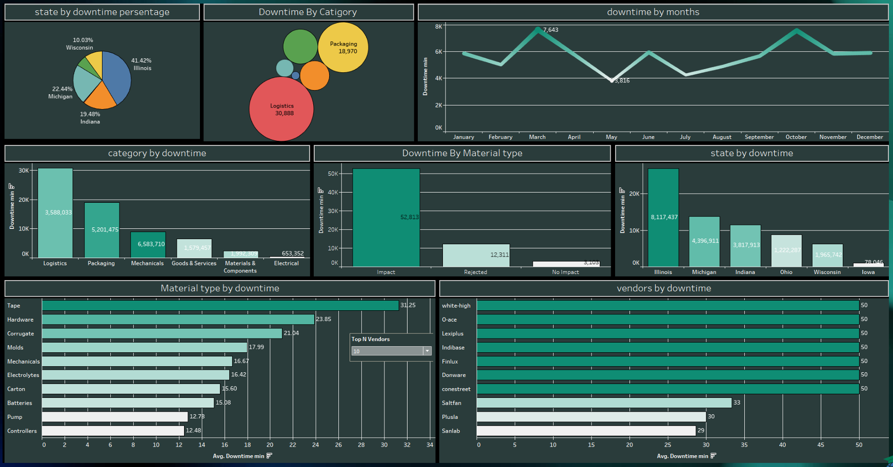

# Suppliers chain report 

### Description for all Audience

This project focuses on analyzing the quality of suppliers (vendors) and its impact on manufacturing downtime. The goal is to identify the best and worst suppliers and determine which plants are most effective at identifying and rejecting defective materials. By understanding these factors, we aim to minimize production downtime and improve overall efficiency.

Key findings include:
- Certain vendors contribute significantly more defects than others.
- Defects classified as "Impact" cause the most downtime.
- There are regional differences in downtime and defect quantities.

### Visualizations

### Description for Technical Audience

This project involves a comprehensive analysis of supplier quality and its effect on manufacturing downtime. The dataset includes information on defects, vendors, plants, and materials. The analysis involves several technical steps:

- **Data Preparation and Cleaning:**
  - Handling duplicates and standardizing defect names.
  - Addressing outliers in defect quantities and downtime using Winsorization.
  - Creating new tables and fixing data inconsistencies.

- **Data Analysis:**
  - Identifying top vendors contributing to defects and downtime.
  - Analyzing defect types and their impact on production.
  - Evaluating state-level differences in downtime and defect quantities.

- **Tools and Technologies:**
  - **Programming Languages:** Python, SQL
  - **Libraries:** Pandas, Scipy, Scikit-Learn
  - **Database:** PostgreSQL
  - **Visualization:** Tableau or similar tools

### Project Structure

1. **Data Overview**
   - Summary of tables and dataset structure.
   - Key trends and findings from data analysis.

2. **Data Preparation and Cleaning**
   - Handling duplicates and standardizing data.
   - Addressing outliers in defect quantities and downtime.

3. **Data Modeling**
   - Creating entity relationship diagrams (ERDs) for data entities like defects, vendors, and plants.

4. **Analytical Report**
   - Analysis of defect types, vendors, materials, and states.
   - Identification of trends and patterns in downtime and defects.

5. **Takeaways**
   - Summary of insights and business recommendations.
   - Strategic actions for improving supplier quality and reducing downtime.

6. **Next Steps**
   - Suggestions for future data grouping and prediction models.
   - Recommendations for supplier performance evaluation and process improvements.

7. **Executive Summary**
   - High-level overview of key findings and their implications for the business.

### Key Findings

- **Top Vendors by Defects:**
  - Vendors like Dentocity and Quotelane contribute the most defects.
  - Plustax and Solholdings have the highest downtime.

- **Defect Types:**
  - "Impact" defects cause the highest downtime (average of 27 minutes).
  - "No Impact" defects are the most frequent but cause minimal downtime.

- **Material Types:**
  - Corrugated materials lead to the highest downtime.
  - Raw materials have the least impact on downtime.

- **State-Level Analysis:**
  - Iowa and Ohio have the highest downtime.
  - Illinois leads in defect quantity.

### Conclusion

This project provides valuable insights into supplier quality and its impact on manufacturing efficiency. By focusing on high-defect vendors, optimizing defect classification, and addressing state-specific issues, businesses can significantly reduce downtime and improve production.