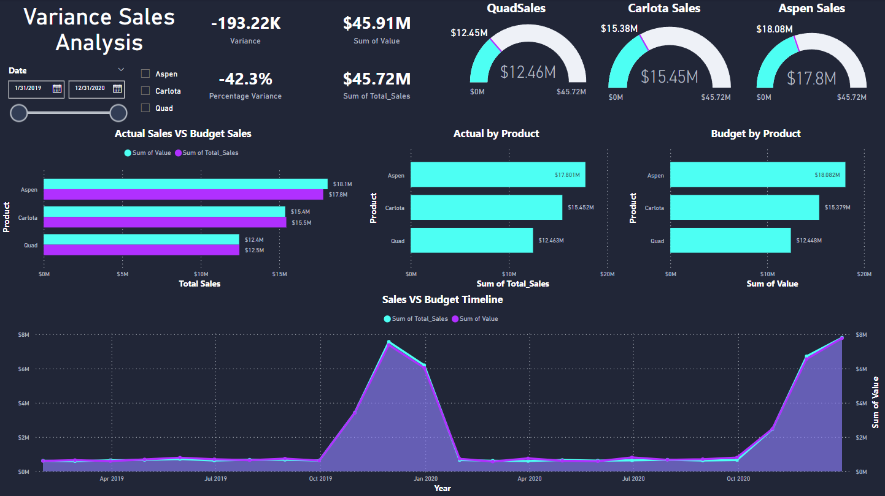

# Variance Analysis Project

## Overview
This project focuses on analyzing the variance between budgeted and actual sales data for different products over time. The project includes several steps, from loading data into a database to creating a dashboard that visualizes the variance analysis.
## Visualizations

## Project Structure
- **ANOVA**: Understand the concept of Analysis of Variance (ANOVA) and its relevance to the project.
- **Database Creation**: Load the budget and actual sales data into a SQL database.
- **Data Preparation**: Unpivot the budget data to create a tabular format that can be compared with the actual sales data.
- **Variance Calculation**: Calculate the variance and percentage variance between budgeted and actual sales.
- **Dashboard**: Create a business intelligence (BI) dashboard to visualize the variance analysis.

## Key SQL Functions
1. **Unpivoting Budget Data**:
   - A function (`unpivot_budget()`) was created to convert non-tabular budget data into a tabular format, making it easier to compare with actual sales data.
   
2. **Tabular Tables**:
   - `Tabular_Budget`: Stores the unpivoted budget data.
   - `Tabular_Actual`: Stores the aggregated actual sales data.

3. **Variance Calculation**:
   - Calculate total sales, budget, and the variance between them using SQL queries.

## Variance Formulas
- **Variance**: `Variance = SUM(Actual Sales) - SUM(Budgeted Sales)`
- **Percentage Variance**: `Percentage Variance = ((SUM(Actual Sales) - SUM(Budgeted Sales)) / SUM(Actual Sales)) * 100`

## Usage
1. **Database Setup**: Run the provided SQL scripts to set up the database and populate it with the required data.
2. **Data Insertion**: Insert data into the `Tabular_Budget` and `Tabular_Actual` tables using the provided SQL functions.
3. **Analysis**: Use SQL queries to analyze the variance between actual and budgeted sales.

## Conclusion
The project successfully demonstrates how to perform variance analysis using SQL, from data preparation to creating a BI dashboard. The results help in understanding discrepancies between budgeted and actual performance, aiding in better decision-making.